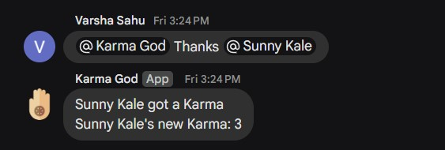
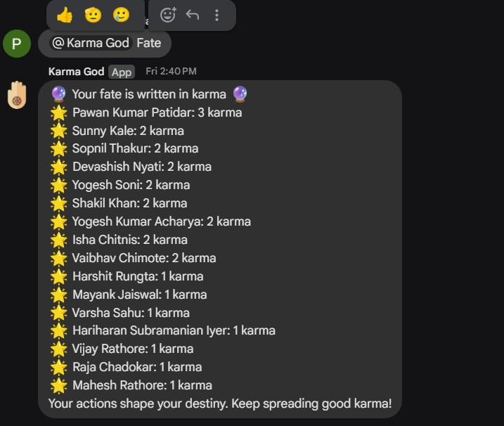

# KarmaGod Setup Guide

This guide will walk you through setting up the KarmaGod Google Chat bot, which allows users to give and receive karma within your Google Chat spaces.

## Note
This is a vibe coding project and might have bugs. Feel free to report them or send pull requests to add features.

## Screenshots

Here are a few screenshots of the bot in action:

**Thanks Command:**

**Fate Command:**

## Using the KarmaGod Bot

1.  **Add the Bot to a Space:**
    * In Google Chat, go to the space where you want to use the bot.
    * Add the bot to the space.
2.  **Commands:**
    * `@KarmaGod thanks @user1 @user2 ...`: Gives karma to the mentioned users.
    * `@KarmaGod fate`: Returns the fate of users in that space.

## Prerequisites

* A Google account with access to Google Sheets, Google Apps Script, and Google Cloud Platform (GCP).
* A Google Chat space where you want to use the bot.

## 1. Google Sheet Setup

1. **Create a New Google Sheet:**
    * Go to Google Sheets (sheets.google.com).
    * Create a new blank spreadsheet.
2. **Note the Sheet ID and Name:**
    * The Sheet ID is found in the URL of your spreadsheet (e.g., `d/YOUR_SHEET_ID/`).
    * The Sheet Name is the name of the tab at the bottom of the spreadsheet (e.g., "Sheet1").
    * You will need these later in App Scripts.

## 2. Google Apps Script Setup

1.  **Create a New Apps Script Project:**
    * In your Google Sheet, go to "Extensions" > "Apps Script."
    * This will open a new Apps Script project associated with your sheet.
2.  **Copy and Paste the Script:**
    * Copy paste the code from code.gs.
    * Make sure to replace `YOUR_SHEET_ID` and `SHEET_NAME` with the values you obtained in the previous step.
    * Also make sure that `KARMA_GOD_NAME` is set to the display name of the bot.
3.  **Add OAuth Scopes:**
    * Click the gear icon ("Project Settings") on the left sidebar.
    * Check the "Show manifest file" checkbox.
    * Copy paste the contents from appsscript.json to this file and save it.
4.  **Deploy the Script:**
    * Go to "Deploy" > "New deployment."
    * Select "Chat app" as the deployment type.
    * Create a new deployment.
    * Note the "Deployment ID" from the deployment dialog.

## 3. Google Cloud Console API Setup

1.  **Enable the Google Chat API:**
    * Go to the Google Cloud Platform (GCP) console (console.cloud.google.com).
    * Select the same GCP project associated with your Apps Script project.
    * Search for "Google Chat API" and enable it.
2.  **Configure the Chat App:**
    * On the Google Chat API page, go to the "Configuration" tab.
    * Paste the "Deployment ID" from your Apps Script project into the "App deployment ID" field.
    * Enable "Interactivity."
    * Enable "Enable 1:1 Messages" if you want the bot to work in direct messages.
    * Save the configuration.

## 4. Chat App Publishing

1.  **Publish the App:**
    * In the Google Chat API configuration page, go to the "Publish" tab.
    * Fill out the required information (app name, description, etc.).
    * Click "Publish."
    * The app will be available to users in your Google Workspace domain.

## Troubleshooting

* **Permissions Errors:**
    * Ensure that your Apps Script project has the necessary OAuth scopes.
    * Double-check that you've authorized the script.
* **Bot Not Responding:**
    * Verify that the deployment ID in GCP is correct.
    * Check the Apps Script execution logs and Cloud Logging for errors.
* **Sheet Errors:**
    * Ensure that the sheet ID and name are correct.
    * Verify that the Google account running the script has access to the sheet.
* **API Errors:**
    * Verify that the Google Chat API is enabled in your GCP project.
    * Check for any reported outages on the Google Workspace Status Dashboard.